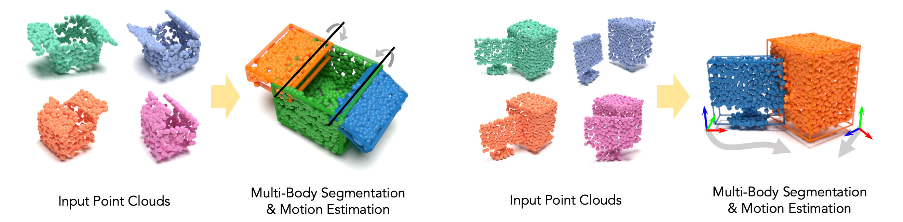

# MultiBodySync: Multi-Body Segmentation and Motion Estimation via 3D Scan Synchronization

This repository contains a PyTorch implementation of the above paper. It will be presented at [CVPR2021](http://cvpr2021.thecvf.com/) as an oral.
- Paper Link: https://arxiv.org/abs/2101.06605
- Authors: [Jiahui Huang](https://cg.cs.tsinghua.edu.cn/people/~huangjh/), [He Wang](http://ai.stanford.edu/~hewang/), [Tolga Birdal](http://tbirdal.me/), [Minhyuk Sung](https://mhsung.github.io/), [Federica Arrigoni](https://scholar.google.com/citations?user=bzBtqfQAAAAJ&hl=nl), [Shi-Min Hu](https://cg.cs.tsinghua.edu.cn/shimin.htm), [Leonidas Guibas](https://geometry.stanford.edu/member/guibas/)
    - Contact Jiahui either via email or github issues :)
- Talks & Videos: Coming soon.

## Introduction



MultiBodySync is an end-to-end trainable **multi-body motion segmentation and rigid registration framework for multiple input 3D point clouds** with the following features:
- Guaranteed correspondence and segmentation consistency across multiple input point clouds capturing different spatial arrangements of bodies or body parts.
- Robust motion-based rigid body segmentation applicable to novel object categories. 

## Usage

Please install Pytorch (>=1.6) and run the following code (e.g. in a notebook), then you get our model ready for inference:
```python
import torch
# Load model
my_model = torch.hub.load('huangjh-pub/multibody-sync:public', 'model_articulated', pretrained=True)
my_model.cuda().eval()
# Perform inference, data has to be (1, K, N, 3) cuda tensor.
my_model.forward(data)
```
You may also need an example input (e.g. the one under `assets/laptop.npy`) to feed into the model. We suggest you normalize your point cloud (preferably with *-Y axis* up) beforehand to get the best result.

## Dependencies

We suggest to use [Anaconda](https://www.anaconda.com/) to manage your environment. Following is the suggested way to install the dependencies:

```shell script
# Create a new conda environment
conda create -n mbs python=3.8
conda activate mbs

# Install pytorch
conda install pytorch==1.6.0 cudatoolkit=10.2 -c pytorch

# Install other packages
pip install -r requirements.txt
```

For domestic users please consider using a [mirror](https://mirrors.tuna.tsinghua.edu.cn/help/anaconda/) if there are connection problems.

## Dataset

Each dataset is organized in the following structure:
```
<dataset-name>/
    ├ meta.json
    └ data/
        ├ 000000.npz
        ├ 000001.npz
        └ ...
```
After downloading the dataset, please set the paths in the corresponding yaml config files to the root of the dataset folder, i.e., `<dataset-name>/`.

### Articulated Objects

- Train+Val (`mbs-shapepart`): [Google Drive](https://drive.google.com/file/d/1aGTn-PYxLjnhj9UKlv4YFV3Mt1E3ftci/view?usp=sharing)
- Test (`mbs-sapien`): [Google Drive](https://drive.google.com/file/d/1HR2X0DjgXLwp8K5n2nsvfGTcDMSckX5Z/view?usp=sharing)

### Solid Objects

- Train+Val (`mbs-shapewhole`): [Google Drive](https://drive.google.com/file/d/1vAgavEzPJFG6lrwsl46ii1V5r3JM_zGR/view?usp=sharing)
- Test (`mbs-dynlab`): [Google Drive](https://drive.google.com/file/d/1sLOa-FfHzTslJ5MItKcAL5OQ7xr4_cju/view?usp=sharing)

### DynLab Dataset

The raw dataset can be downloaded [Here](https://drive.google.com/file/d/10nEju2C2uUKpAwRGk-3l9HFoNmQikmt-/view?usp=sharing). The files are organized as 8 scenes x 8 configurations = 64 (point cloud, pose) tuples, each of which is formatted as:
- `<scene_id>-<config_id>.ply`: 3D point cloud data with point positions (`x`,`y`,`z`), colors (`red`, `green`, `blue`) and segmentation (`idx`) stored in a PLY format.
- `<scene_id>-<config_id>.pose`: Pose file containing the annotated pose of each object. The index in this file corresponds to the segmentation in PLY files.

## Training and Test

Please use the following commands for training.
We suggest to train the `flow` network and `mot` network simultaneously and then train `conf` network after `flow` is fully converged.
```shell script
# Train flow network
python train.py config/articulated-flow.yaml
# Train mot network
python train.py config/articulated-mot.yaml
# Train conf network
python train.py config/articulated-conf.yaml
```

Then the entire pipeline can be tuned end-to-end using the following:
```shell script
python train.py config/articulated-full.yaml
```
After training, run the following to test your trained model:
```shell script
python test.py config/articulated-full.yaml
```

### Pre-trained models
Please download the corresponding trained weights for [articulated objects](https://drive.google.com/file/d/1bomD88-6N1iGsTtftfGvAm9JeOw8gKwb/view?usp=sharing) or [solid objects](https://drive.google.com/file/d/1L5jQtTG47pCRvekxSUo_T0zS_IkVZUgm/view?usp=sharing) and extract the weights to `./ckpt/articulated-full/best.pth.tar`.

For solid objects, simply do `%s/articulated/solid/g`.

## Citation

The paper will not appear in the proceedings before the conference actually takes place. For now you may use the following bibtex:
```
@article{huang2021multibodysync,
  title={MultiBodySync: Multi-Body Segmentation and Motion Estimation via 3D Scan Synchronization},
  author={Huang, Jiahui and Wang, He and Birdal, Tolga and Sung, Minhyuk and Arrigoni, Federica and Hu, Shi-Min and Guibas, Leonidas},
  journal={arXiv preprint arXiv:2101.06605},
  year={2021}
}
```

## Other implementations

- [MultiBodySync Jittor](https://github.com/heiwang1997/mbs-jittor): Jittor implementation.

## Reference code

- [erikwijmans/Pointnet2_PyTorch](https://github.com/erikwijmans/Pointnet2_PyTorch)
- [DylanWusee/PointPWC](https://github.com/DylanWusee/PointPWC) (this codebase is completely reorganized so the logic is a bit more clear)
- [zjhthu/OANet](https://github.com/zjhthu/OANet)
